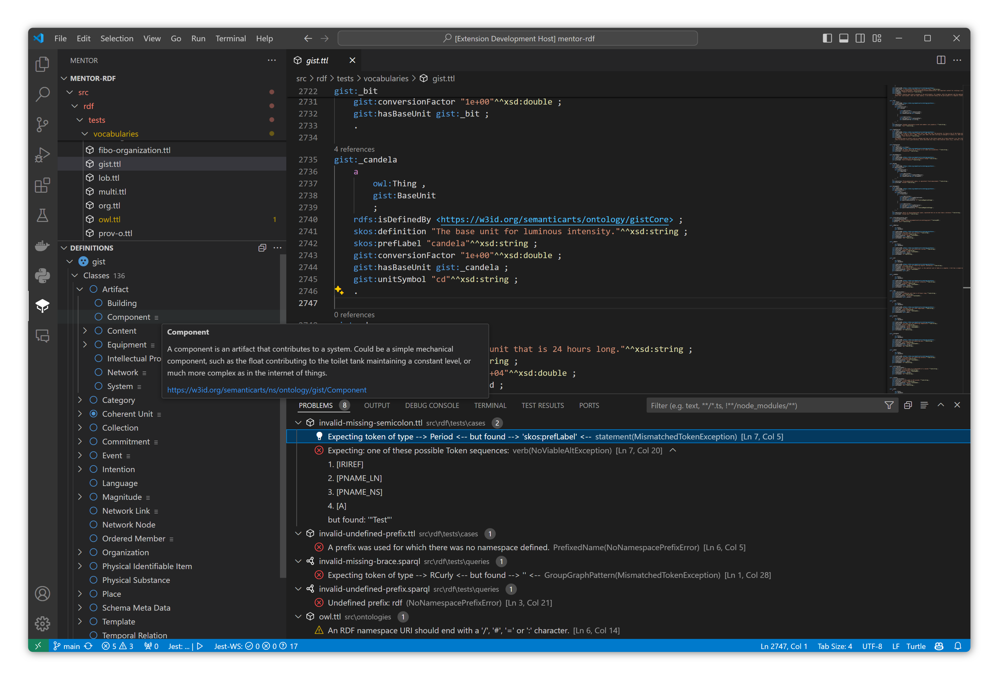

# Mentor RDF for Visual Studio Code
[](./LICENSE)

This extension provides powerful editing support for RDF ontologies and knowledge graph projects in Visual Studio Code.



## Features
> **Tip:** Try it with <a href="https://marketplace.visualstudio.com/items?itemName=GitHub.copilot">GitHub Copilot</a> for best in code editing experience.

This extension provides the following features:

- **Workspace Tree**
  - Navigate all ontology and SPARQL files in the project
- **Ontology Tree**
  - Showing definitions of classes, properties and individuals
  - Quickly jump to definitions
  - RDFS and limited OWL reasoning
  - Find all references in the current document
  - Open URIs in browser
- **Supports N3, Turtle, Trig and SPARQL**
  - Syntax highlighting
  - Syntax validation
  - Checking conformance of literal values to XSD specifications
  - Checking if namespace IRIs end with separator (`/`,`#`, `:`)
- **Refactoring**
  - Rename prefixes
  - Rename resource labels in prefixed names and URIs

## Installation

You can install the Mentor extension directly from the [Visual Studio Code marketplace](https://marketplace.visualstudio.com/VSCode). Follow these steps:

1. Open Visual Studio Code.
2. Click on the Extensions view icon on the Sidebar (or press `Ctrl+Shift+X`).
3. In the Extensions view, enter `Mentor` in the search form and press `Enter`.
4. Locate the Mentor extension in the search results and click on the install button.

Alternatively, if you have the `.vsix` file of the extension, you can install it manually:

1. Open Visual Studio Code.
2. Click on the Extensions view icon on the Sidebar.
3. Click on the `...` at the top of the Extensions view, select `Install from VSIX...`.
4. Locate the `.vsix` file and click `Open`.

After installation, you may need to reload Visual Studio Code to activate the extension.

## Contributing

Contributions are always welcome! To start off, fork this repository on GitHub and then clone the fork to your local computer.

### Building

Once cloned, add an upstream remote pointing to the primary toolkit repo.

```bash
git clone https://github.com/faubulous/mentor-vscode.git
cd mentor-vscode
```

Install the project dependencies.

```bash
npm install
```

Create a development build of the extension.

```bash
npm run build:watch
```

### Debugging

To start debugging the 'Launch Extension' configuration, follow these steps:

1. Open Visual Studio Code.
2. Click on the Run view icon on the Sidebar (or press `Ctrl+Shift+D`).
3. At the top of the Run view, in the dropdown list of debug configurations, select 'Launch Extension'.
4. After the configuration is set, you can start debugging by clicking on the green 'Start Debugging' button (or press `F5`).

This will start a new instance of Visual Studio Code with the Mentor extension loaded. You can set breakpoints in your code to stop execution and inspect variables, call stack, and so on.

### Packaging 
```bash
npm install --global @vscode/vsce
```

```bash
npm run package:install
```

# License
Distributed under the [GPL Version 3 License](LICENSE). See LICENSE for more information.